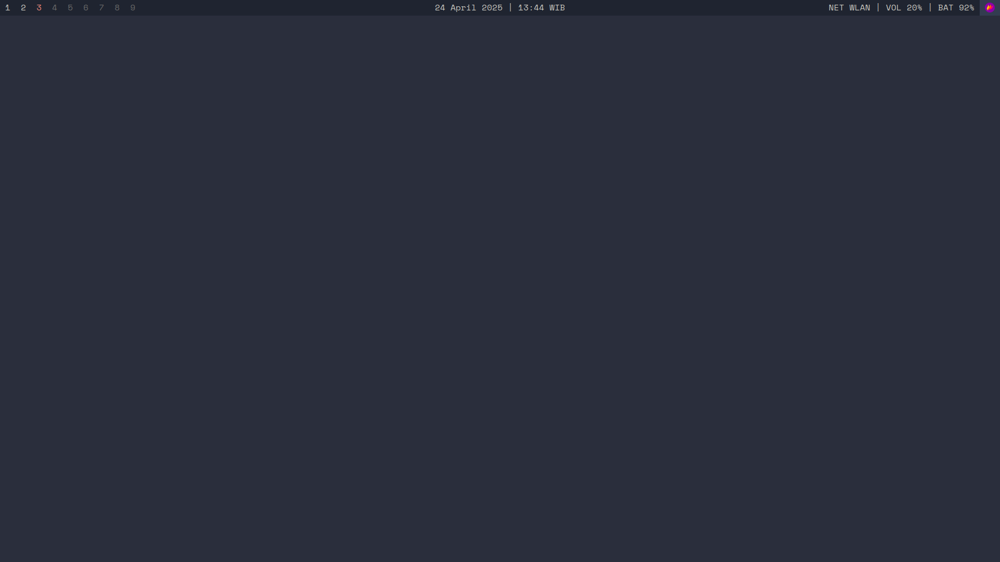
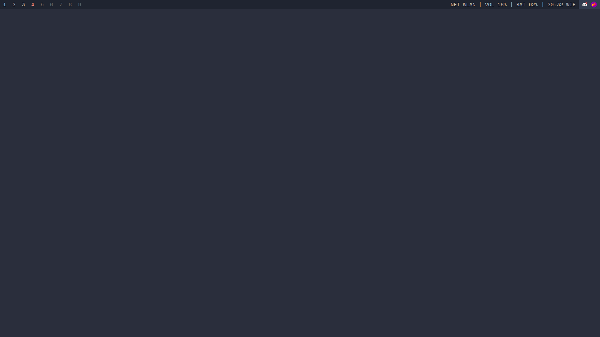
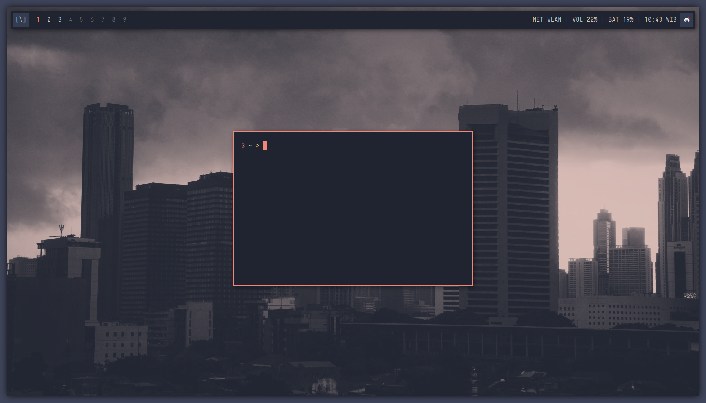
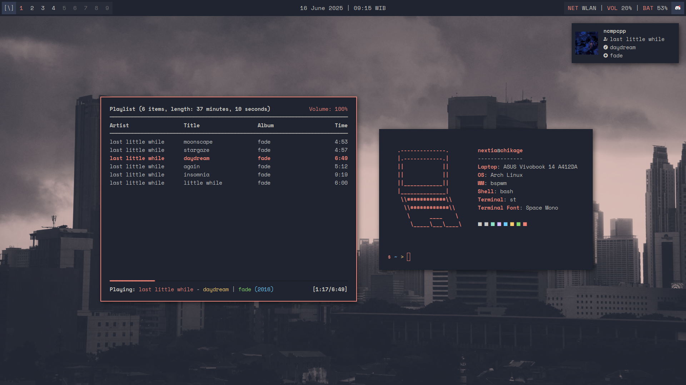
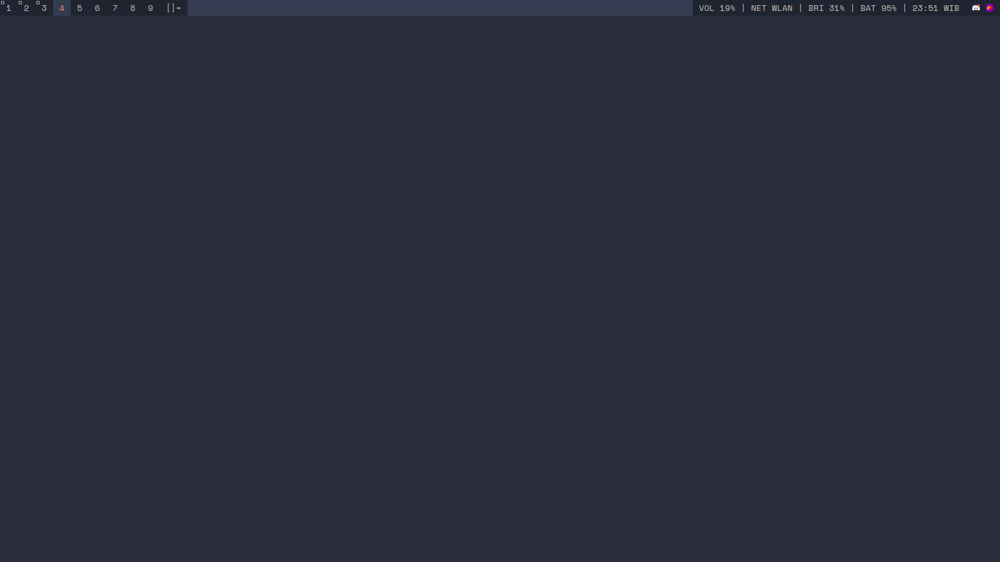
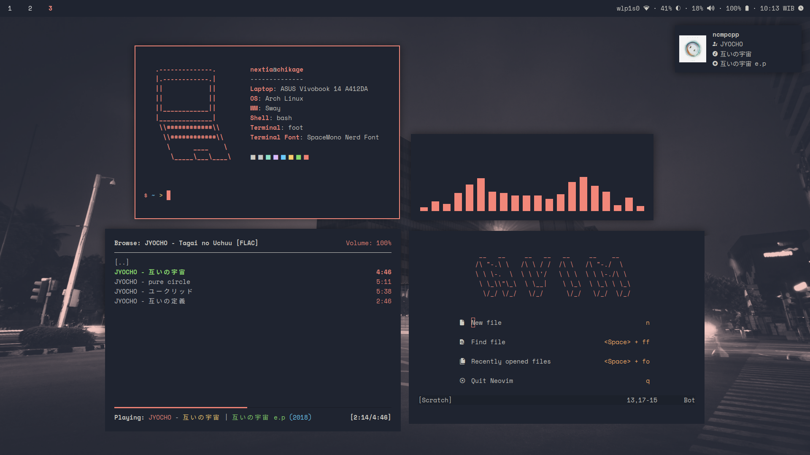
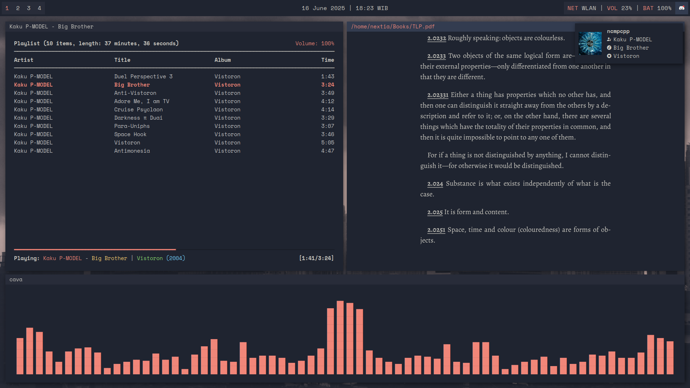

# Dotfiles
This is a repository where I put my Linux dotfiles. You can use all of the dotfiles in this repository, but keep it in mind that they are optimized for my needs.

# Screenshots
## bspwm
### old setup

### latest setup

## dwm

## SwayFX

## i3

# suckless build
- [dwm](https://codeberg.org/nextiaindex/dwm)
- [st](https://codeberg.org/nextiaindex/st)
- [slstatus](https://codeberg.org/nextiaindex/slstatus)
- [slock](https://codeberg.org/nextiaindex/slock)

