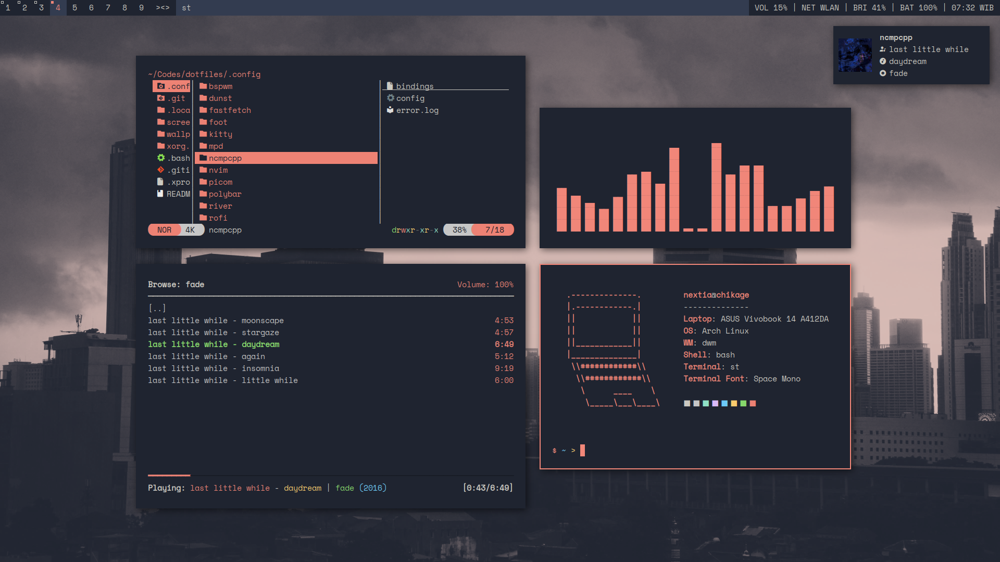

# Dotfiles
This is a repository where I put my Linux dotfiles. You can use all of the dotfiles in this repository, but keep it in mind that they are optimized for my needs.

# Screenshots
## bspwm
### old

## dwm

# suckless build
- [dwm](https://github.com/nextiaindex/dwm)
- [st](https://github.com/nextiaindex/st)
- [slstatus](https://github.com/nextiaindex/slstatus)
